# The Social Network: API

## User Story

```md
AS A social media startup
I WANT an API for my social network that uses a NoSQL database
SO THAT my website can handle large amounts of unstructured data
```

## Acceptance Criteria

```md
GIVEN a social network API
WHEN I enter the command to invoke the application
THEN my server is started and the Mongoose models are synced to the MongoDB database
WHEN I open API GET routes in Insomnia for users and thoughts
THEN the data for each of these routes is displayed in a formatted JSON
WHEN I test API POST, PUT, and DELETE routes in Insomnia
THEN I am able to successfully create, update, and delete users and thoughts in my database
WHEN I test API POST and DELETE routes in Insomnia
THEN I am able to successfully create and delete reactions to thoughts and add and remove friends to a user’s friend list
```

## Technologies Used

- Node.js
- Express.js
- Mongoose
- MongoDB
- RESTful API

## Installation

1. Clone the repository.
2. Install dependencies using run `npm install`.
3. Start the application using `npm start`.
4. Explore routes using Insomnia or similar. 

## Routes

- /api/users
    - GET (Get all users)
    - 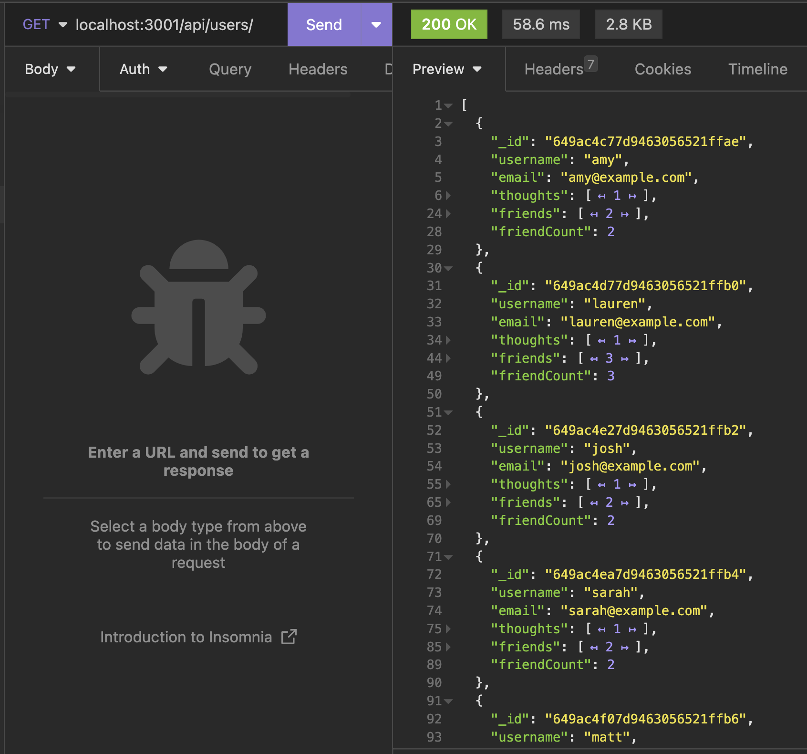
    - POST (Create user)
    - 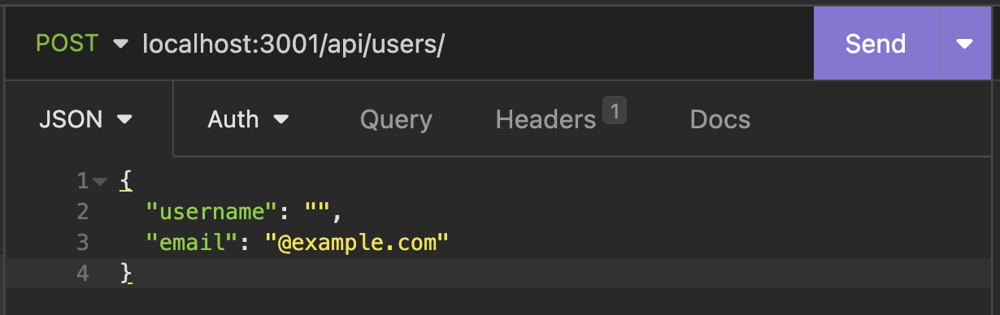
- /api/users/:userId
    - GET (Get single user)
    - 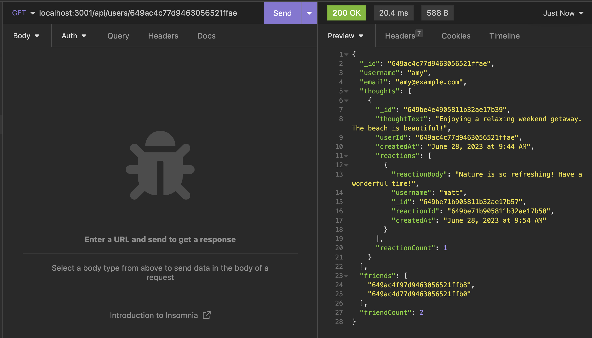
    - PUT (Update user)
    - 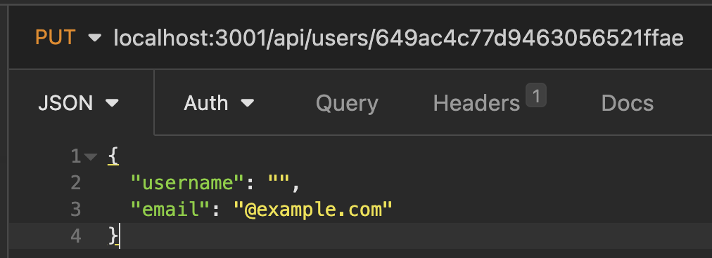
    - DELETE (Delete user)
    - 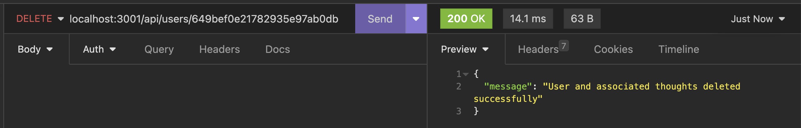
- /api/users/:userId/friends/:friendId
    - POST (Add friend)
    - 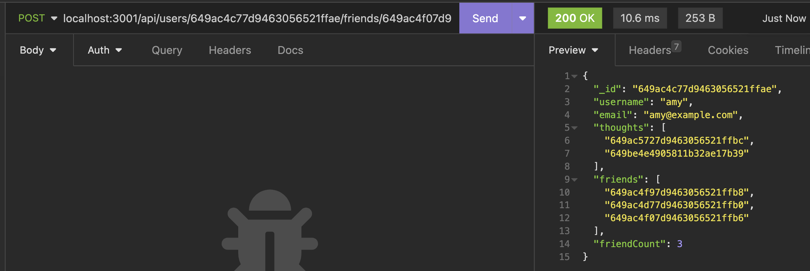
    - DELETE (Delete friend)
    - 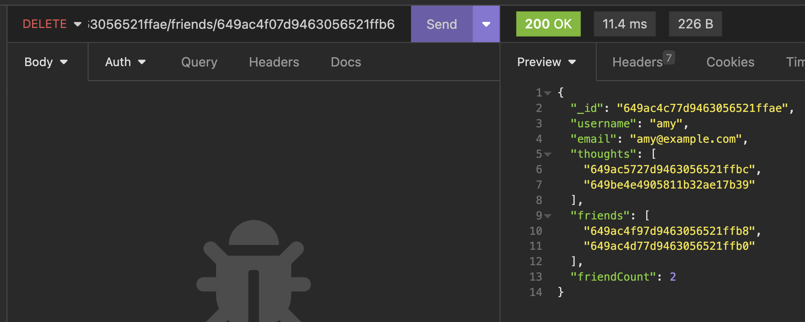
- /api/thoughts
    - GET (Get all thoughts)
    - 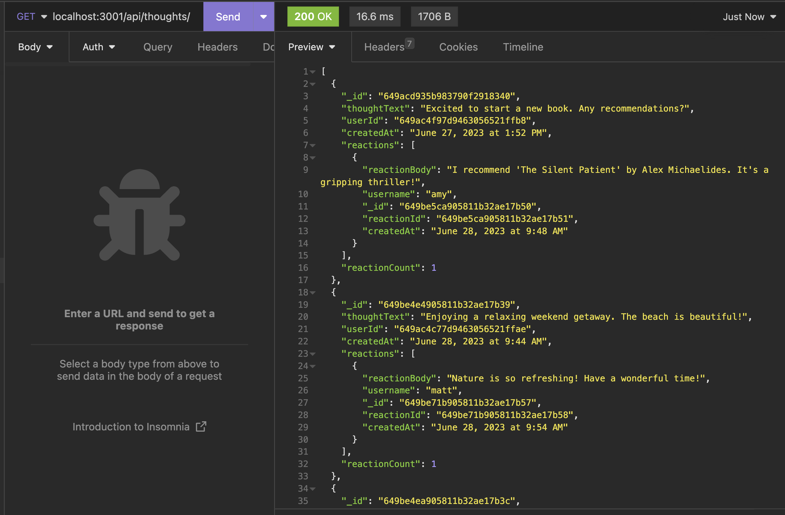
    - POST (Create thought)
    - 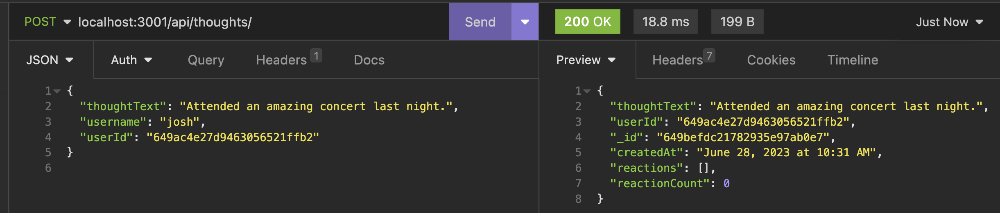
- /api/thoughts/:thoughtId
    - GET (Get single thought)
    - 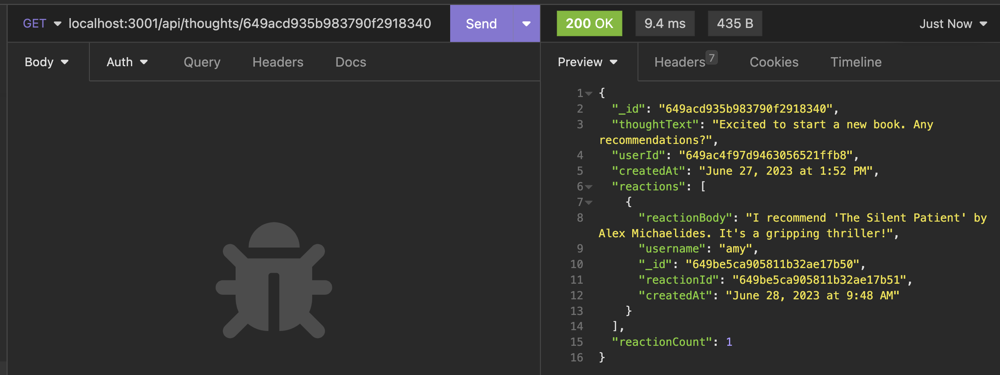
    - PUT (Update thought)
    - 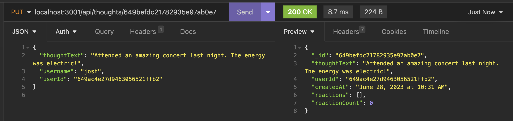
    - DELETE (Delete thought)
    - 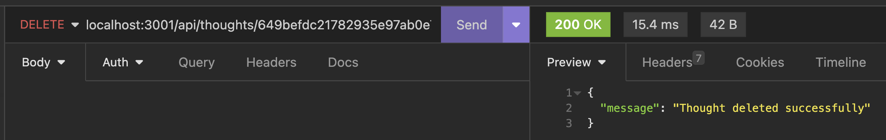
- /api/thoughts/:thoughtId/reactions
    - POST (Create reaction)
    - 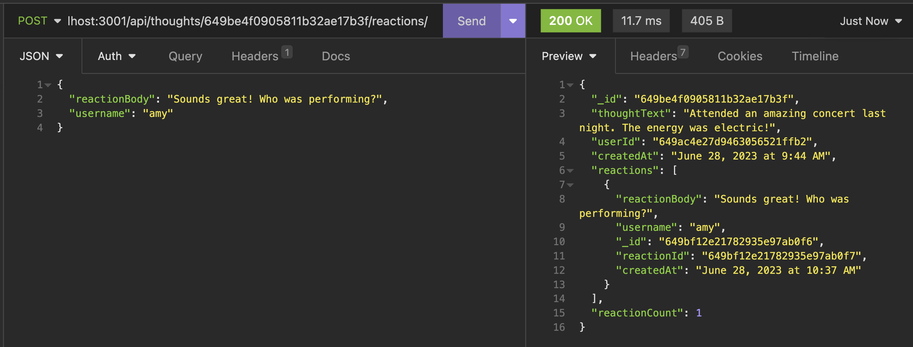
- /api/thoughts/:thoughtId/reactions/:reactionId
    - DELETE (Delete reaction)
    - 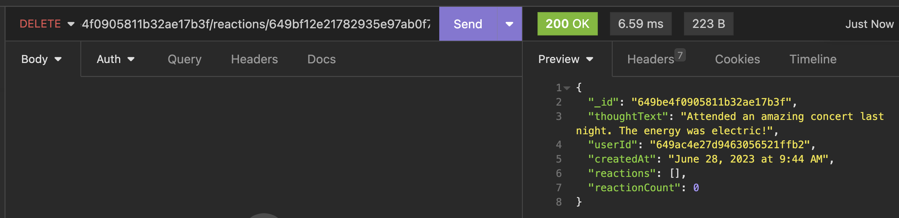
    
## Mockup
The following video shows an example of the Social Network API being operated from the Comand Line and Insomnia:

[A video shows the Social Network API being operated from the Comand Line and Insomnia.](https://drive.google.com/file/d/1DCbxPjKqxbKYuRV3mzuYkadEhyYcL5Ii/view?usp=sharing)

## Contact

Isabel Vaughan

- LinkedIn: [linkedin.com/in/isabelknoonan](https://www.linkedin.com/in/isabelknoonan/)
- GitHub profile: [github.com/isabelkvaughan](https://github.com/isabelkvaughan)
